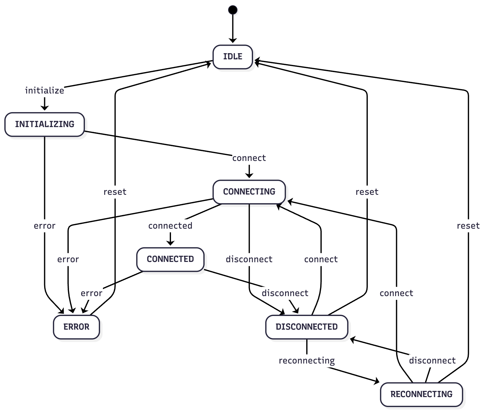

# @marianmeres/webrtc

[](https://www.npmjs.com/package/@marianmeres/webrtc)
[](https://jsr.io/@marianmeres/webrtc)

A lightweight, framework-agnostic WebRTC manager with state machine-based lifecycle management and event-driven architecture.

## Features

- **State Machine-based**: Clean state transitions (IDLE → INITIALIZING → CONNECTING → CONNECTED)
- **Event-driven**: Subscribe to specific events or overall state changes
- **Svelte Store Compatible**: Works seamlessly with Svelte's reactive `$` syntax
- **Audio Management**: Microphone enable/disable, device switching, device change detection
- **Data Channels**: Easy creation and management of RTCDataChannels
- **Auto-reconnection**: Optional automatic reconnection with exponential backoff
- **TypeScript**: Full type safety and excellent IDE support

## Installation

```bash
npm install @marianmeres/webrtc
```

## High-Level Overview

The `WebRtcManager` class handles the complete WebRTC connection lifecycle:

1. **Initialization**: Sets up RTCPeerConnection, media streams, and data channels
2. **Connection Management**: Handles state transitions, reconnection, and cleanup
3. **Signaling**: Provides methods for offer/answer exchange and ICE candidate handling
4. **Media Control**: Manages local/remote streams and microphone switching
5. **Events**: Emits events for all important state changes

The manager doesn't handle the signaling transport layer - you're responsible for sending/receiving offers, answers, and ICE candidates through your own signaling mechanism (WebSocket, HTTP, etc.).

## Core API

### Constructor

```typescript
const manager = new WebRtcManager<TContext>(factory, config);
```

- `TContext`: Optional type parameter for the `context` property (default: `unknown`)

- `factory`: Object implementing `WebRtcFactory` interface (provides `createPeerConnection`, `getUserMedia`, `enumerateDevices`)
- `config`: Optional configuration object

**Configuration Options:**
- `peerConfig`: RTCConfiguration (ICE servers, etc.)
- `enableMicrophone`: Enable microphone on initialization (default: false)
- `dataChannelLabel`: Create a default data channel with this label
- `autoReconnect`: Enable automatic reconnection (default: false)
- `maxReconnectAttempts`: Max reconnection attempts (default: 5)
- `reconnectDelay`: Initial reconnection delay in ms (default: 1000)
- `fullReconnectTimeout`: Timeout in ms for full reconnection to succeed (default: 30000)
- `shouldReconnect`: Callback to control whether reconnection should proceed (see below)
- `debug`: Enable debug logging (default: false)
- `logger`: Custom logger instance implementing `Logger` interface (default: console)

### State and Properties

```typescript
manager.state                 // Current WebRtcState
manager.localStream           // MediaStream | null
manager.remoteStream          // MediaStream | null
manager.dataChannels          // ReadonlyMap<string, RTCDataChannel>
manager.peerConnection        // RTCPeerConnection | null
manager.context               // TContext | null - user-defined data
```

### Lifecycle Methods

```typescript
await manager.initialize()    // Initialize peer connection
await manager.connect()       // Transition to CONNECTING state
manager.disconnect()          // Disconnect and cleanup
manager.reset()               // Reset to IDLE state
```

### Audio Methods

```typescript
await manager.enableMicrophone(true)           // Enable/disable microphone
await manager.switchMicrophone(deviceId)       // Switch to different audio input
await manager.getAudioInputDevices()           // Get available audio inputs
```

### Signaling Methods

```typescript
const offer = await manager.createOffer()
const answer = await manager.createAnswer()
await manager.setLocalDescription(offer)
await manager.setRemoteDescription(answer)
await manager.addIceCandidate(candidate)
await manager.iceRestart()                     // Trigger ICE restart
await manager.gatherIceCandidates(options)     // Wait for ICE gathering to complete
```

### gatherIceCandidates(options?)

Wait for ICE gathering to complete. Useful for HTTP POST signaling patterns where you need all ICE candidates bundled in the local description before sending to the server.

**Options:** `timeout` (ms, default 10000), `onCandidate` (callback for each candidate)

```typescript
const offer = await manager.createOffer();
await manager.setLocalDescription(offer);
await manager.gatherIceCandidates({ timeout: 5000 });
// Now manager.peerConnection.localDescription has all ICE candidates bundled
```

**Error Handling:** A timeout rejection does *not* transition the FSM to ERROR state. This is intentional - `gatherIceCandidates()` is a utility method, and a timeout means "gathering didn't complete in time", not "the connection failed". The consumer decides how to handle it:

```typescript
try {
  await manager.gatherIceCandidates({ timeout: 5000 });
} catch (e) {
  if (e.message === "ICE gathering timeout") {
    // Options:
    // 1. Retry with longer timeout
    // 2. Proceed anyway - localDescription may have partial candidates
    // 3. Treat as fatal: manager.reset()
  }
}
```

### Data Channel Methods

```typescript
const dc = manager.createDataChannel(label, options)
const dc = manager.getDataChannel(label)
manager.sendData(label, data)                  // Returns boolean
```

### Working with External Audio Streams

You might want to keep `enableMicrophone: false` even when your application uses audio. Common scenarios include:

- **Pre-acquired stream**: You may have obtained the audio stream earlier in the application flow (e.g., during a permissions check, in a lobby/waiting room, or for local audio preview before joining)
- **Custom audio processing**: You want to apply audio effects, noise suppression, or other processing via Web Audio API before transmitting
- **Multiple sources**: You need to mix audio from multiple sources (microphone + system audio, multiple microphones, background music, etc.)
- **Fine-grained privacy control**: You want explicit control over exactly when the microphone activates
- **Testing**: You want to inject synthetic audio (e.g., oscillator tones) for automated testing

To use your own audio stream, access the `peerConnection` directly and add tracks after initialization:

```typescript
const manager = new WebRtcManager(factory, {
  peerConfig: { iceServers: [{ urls: 'stun:stun.l.google.com:19302' }] },
  enableMicrophone: false, // We'll handle the audio stream ourselves
});

// Your pre-acquired or processed audio stream
const myAudioStream = await navigator.mediaDevices.getUserMedia({ audio: true });

// Or a processed stream via Web Audio API
const audioCtx = new AudioContext();
const source = audioCtx.createMediaStreamSource(myAudioStream);
const gainNode = audioCtx.createGain();
gainNode.gain.value = 0.8;
source.connect(gainNode);
const destination = audioCtx.createMediaStreamDestination();
gainNode.connect(destination);
const processedStream = destination.stream;

// Initialize the manager
await manager.initialize();

// Add your audio track to the peer connection
const pc = manager.peerConnection;
if (pc) {
  processedStream.getAudioTracks().forEach((track) => {
    pc.addTrack(track, processedStream);
  });
}

// Continue with normal connection flow
await manager.connect();
const offer = await manager.createOffer();
// ...
```

### Event Subscription

```typescript
// Subscribe to specific event
const unsub = manager.on(WebRtcManager.EVENT_STATE_CHANGE, (state) => {
  console.log('State changed:', state);
});

// Subscribe to overall state (Svelte store compatible)
const unsub = manager.subscribe((state) => {
  console.log('Overall state:', state);
  // state = { state, localStream, remoteStream, dataChannels, peerConnection }
});
```

**Available Event Constants:**
- `EVENT_STATE_CHANGE`
- `EVENT_LOCAL_STREAM`
- `EVENT_REMOTE_STREAM`
- `EVENT_DATA_CHANNEL_OPEN`
- `EVENT_DATA_CHANNEL_MESSAGE`
- `EVENT_DATA_CHANNEL_CLOSE`
- `EVENT_ICE_CANDIDATE`
- `EVENT_RECONNECTING`
- `EVENT_RECONNECT_FAILED`
- `EVENT_DEVICE_CHANGED`
- `EVENT_MICROPHONE_FAILED`
- `EVENT_ERROR`

### Controlling Reconnection

When `autoReconnect` is enabled, you can use the `shouldReconnect` callback to conditionally suppress reconnection attempts. This is useful when the remote peer disconnected intentionally (e.g., left the call) rather than due to network failure.

```typescript
let peerLeftIntentionally = false;

const manager = new WebRtcManager(factory, {
  autoReconnect: true,
  shouldReconnect: ({ attempt, maxAttempts, strategy }) => {
    if (peerLeftIntentionally) {
      return false; // Don't reconnect
    }
    return true;
  },
});

// Listen for "goodbye" message from peer before they disconnect
manager.on(WebRtcManager.EVENT_DATA_CHANNEL_MESSAGE, ({ data }) => {
  const msg = JSON.parse(data);
  if (msg.type === 'bye') {
    peerLeftIntentionally = true;
  }
});
```

The callback receives:
- `attempt`: Current reconnection attempt (1-based)
- `maxAttempts`: Configured maximum attempts
- `strategy`: `"ice-restart"` (attempts 1-2) or `"full"` (attempts 3+)

### Reconnection Strategies

The manager uses two reconnection strategies with exponential backoff:

1. **ICE Restart** (attempts 1-2): Lightweight reconnection that keeps the existing peer connection and restarts ICE negotiation. Works when the network path changed but the remote peer is still available.

2. **Full Reconnection** (attempts 3+): Creates a completely new peer connection. This is necessary when ICE restart fails, but **requires consumer action** to complete the signaling handshake.

#### Handling Full Reconnection

When a full reconnection is triggered, the manager will:
1. Clean up the old peer connection
2. Create a new peer connection
3. Emit `EVENT_RECONNECTING` with `strategy: 'full'`

**Important:** The manager cannot automatically complete the signaling handshake for full reconnections. You must listen for the `reconnecting` event and re-establish signaling when the strategy is `'full'`:

```typescript
manager.on(WebRtcManager.EVENT_RECONNECTING, async ({ attempt, strategy }) => {
  console.log(`Reconnecting (attempt ${attempt}, strategy: ${strategy})`);

  if (strategy === 'full') {
    // Re-do the signaling handshake
    const offer = await manager.createOffer();
    await manager.setLocalDescription(offer);
    signalingChannel.send({ type: 'offer', offer });
  }
  // For 'ice-restart', the manager handles it automatically
});
```

If the full reconnection doesn't reach `CONNECTED` state within `fullReconnectTimeout` (default: 30 seconds), it's treated as a failed attempt and the next reconnection attempt begins (or `EVENT_RECONNECT_FAILED` is emitted if max attempts reached).

## Examples

### Basic Usage (Vanilla JavaScript)

```typescript
import { WebRtcManager, WebRtcState } from '@marianmeres/webrtc';

// Create factory (browser implementation)
const factory = {
  createPeerConnection: (config) => new RTCPeerConnection(config),
  getUserMedia: (constraints) => navigator.mediaDevices.getUserMedia(constraints),
  enumerateDevices: () => navigator.mediaDevices.enumerateDevices(),
};

// Create manager
const manager = new WebRtcManager(factory, {
  peerConfig: {
    iceServers: [{ urls: 'stun:stun.l.google.com:19302' }],
  },
  enableMicrophone: true,
  autoReconnect: true,
});

// Subscribe to events
manager.on(WebRtcManager.EVENT_ICE_CANDIDATE, (candidate) => {
  // Send candidate to remote peer via your signaling channel
  signalingChannel.send({ type: 'candidate', candidate });
});

manager.on(WebRtcManager.EVENT_REMOTE_STREAM, (stream) => {
  // Attach remote stream to audio element
  audioElement.srcObject = stream;
});

// Initialize and create offer
await manager.initialize();
await manager.connect();
const offer = await manager.createOffer();
await manager.setLocalDescription(offer);

// Send offer to remote peer via your signaling channel
signalingChannel.send({ type: 'offer', offer });

// Handle incoming signaling messages
signalingChannel.onmessage = async (msg) => {
  if (msg.type === 'answer') {
    await manager.setRemoteDescription(msg.answer);
  } else if (msg.type === 'candidate') {
    await manager.addIceCandidate(msg.candidate);
  }
};
```

### Svelte 5 Integration

```svelte
<script>
  import { WebRtcManager, WebRtcState } from '@marianmeres/webrtc';
  import { onMount } from 'svelte';

  const factory = {
    createPeerConnection: (config) => new RTCPeerConnection(config),
    getUserMedia: (constraints) => navigator.mediaDevices.getUserMedia(constraints),
    enumerateDevices: () => navigator.mediaDevices.enumerateDevices(),
  };

  const manager = new WebRtcManager(factory, {
    peerConfig: {
      iceServers: [{ urls: 'stun:stun.l.google.com:19302' }],
    },
    enableMicrophone: true,
  });

  // Subscribe to overall state (Svelte store compatible!)
  const managerState = $derived(manager.subscribe((state) => state));

  // Or use individual event subscriptions
  let devices = $state([]);

  onMount(() => {
    const unsubDevices = manager.on(
      WebRtcManager.EVENT_DEVICE_CHANGED,
      (devs) => devices = devs
    );

    return () => {
      unsubDevices();
      manager.disconnect();
    };
  });

  async function startCall() {
    await manager.initialize();
    await manager.connect();
    const offer = await manager.createOffer();
    await manager.setLocalDescription(offer);
    // Send offer via your signaling channel
  }

  async function switchMic(deviceId) {
    await manager.switchMicrophone(deviceId);
  }
</script>

<div>
  <p>State: {$managerState.state}</p>
  <p>Microphone: {$managerState.localStream ? 'Enabled' : 'Disabled'}</p>

  <button onclick={startCall}>Start Call</button>

  <select onchange={(e) => switchMic(e.target.value)}>
    {#each devices as device}
      <option value={device.deviceId}>{device.label}</option>
    {/each}
  </select>

  <audio bind:this={remoteAudio} autoplay></audio>
</div>
```

### Complete Peer-to-Peer Example

```typescript
import { WebRtcManager } from '@marianmores/webrtc';

class P2PConnection {
  manager: WebRtcManager;
  signalingChannel: WebSocket;

  constructor(signalingUrl: string) {
    this.manager = new WebRtcManager(
      {
        createPeerConnection: (config) => new RTCPeerConnection(config),
        getUserMedia: (constraints) => navigator.mediaDevices.getUserMedia(constraints),
        enumerateDevices: () => navigator.mediaDevices.enumerateDevices(),
      },
      {
        peerConfig: {
          iceServers: [{ urls: 'stun:stun.l.google.com:19302' }],
        },
        enableMicrophone: true,
        dataChannelLabel: 'chat',
        autoReconnect: true,
      }
    );

    this.signalingChannel = new WebSocket(signalingUrl);
    this.setupSignaling();
    this.setupManagerEvents();
  }

  setupSignaling() {
    this.signalingChannel.onmessage = async (event) => {
      const msg = JSON.parse(event.data);

      switch (msg.type) {
        case 'offer':
          await this.handleOffer(msg.offer);
          break;
        case 'answer':
          await this.manager.setRemoteDescription(msg.answer);
          break;
        case 'candidate':
          await this.manager.addIceCandidate(msg.candidate);
          break;
      }
    };
  }

  setupManagerEvents() {
    // Send ICE candidates to remote peer
    this.manager.on(WebRtcManager.EVENT_ICE_CANDIDATE, (candidate) => {
      this.signalingChannel.send(JSON.stringify({
        type: 'candidate',
        candidate,
      }));
    });

    // Handle remote audio stream
    this.manager.on(WebRtcManager.EVENT_REMOTE_STREAM, (stream) => {
      const audio = document.getElementById('remote-audio') as HTMLAudioElement;
      audio.srcObject = stream;
    });

    // Handle data channel messages
    this.manager.on(WebRtcManager.EVENT_DATA_CHANNEL_MESSAGE, ({ data }) => {
      console.log('Received message:', data);
    });

    // Handle reconnection
    this.manager.on(WebRtcManager.EVENT_RECONNECTING, ({ attempt, strategy }) => {
      console.log(`Reconnecting (attempt ${attempt}, strategy: ${strategy})`);
      if (strategy === 'full') {
        // For full reconnection, we need to re-do the signaling handshake
        this.createOffer();
      }
    });
  }

  async createOffer() {
    await this.manager.initialize();
    await this.manager.connect();
    const offer = await this.manager.createOffer();
    await this.manager.setLocalDescription(offer);

    this.signalingChannel.send(JSON.stringify({
      type: 'offer',
      offer,
    }));
  }

  async handleOffer(offer: RTCSessionDescriptionInit) {
    await this.manager.initialize();
    await this.manager.setRemoteDescription(offer);
    const answer = await this.manager.createAnswer();
    await this.manager.setLocalDescription(answer);

    this.signalingChannel.send(JSON.stringify({
      type: 'answer',
      answer,
    }));
  }

  sendMessage(text: string) {
    this.manager.sendData('chat', text);
  }

  disconnect() {
    this.manager.disconnect();
    this.signalingChannel.close();
  }
}

// Usage
const connection = new P2PConnection('wss://your-signaling-server.com');
await connection.createOffer();
connection.sendMessage('Hello!');
```

## API Reference

For complete API documentation, see [API.md](API.md).

## State Machine

The manager uses a finite state machine with the following states:



## Testing

The project includes two types of tests:

### Unit Tests (Deno)

Mock-based tests for the manager's logic and state transitions:

```bash
deno task test
```

### Interactive Example

The `example/` directory contains a working demo of two peers communicating via WebRTC data channels and audio streams:

```bash
# Build the example bundle
deno task example:build

# Serve the example directory
cd example && deno run -A jsr:@std/http/file-server
```

Then open `http://localhost:8000/` in your browser.

**Structure:**
- `index.html` - Parent page with two side-by-side iframes, acts as signaling relay via `postMessage`
- `peer1.html` - The "offerer" peer (click "Connect" to initiate)
- `peer2.html` - The "answerer" peer (waits for connection)
- `peer.js` - Shared utilities (factory, beep generation, logging)

This example demonstrates:
- P2P connection establishment without a signaling server (uses `postMessage` between iframes)
- SDP offer/answer exchange with bidirectional audio setup
- ICE candidate exchange
- Data channel creation and message passing
- **Audio streaming via WebRTC media tracks** (click "Send Beep" to transmit generated audio)
- State change monitoring

## License

MIT